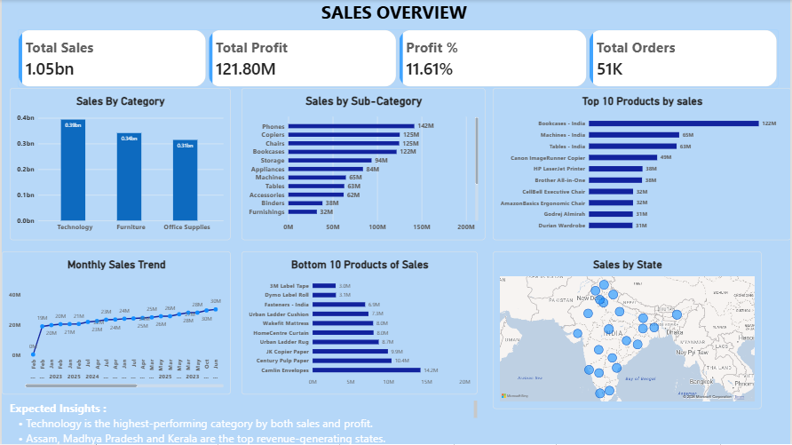
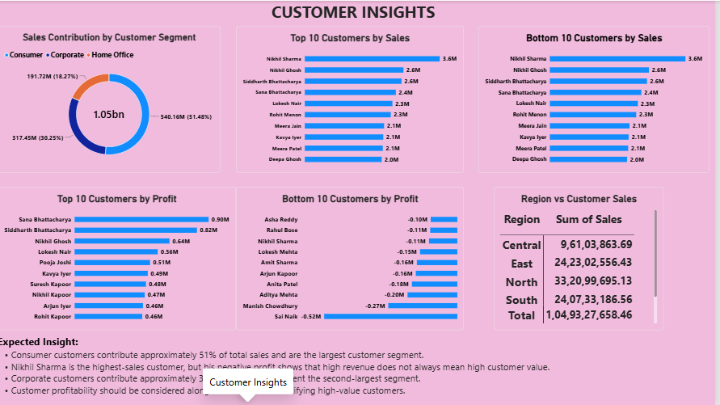
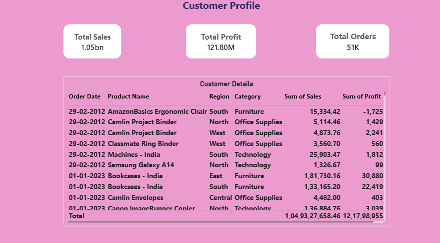
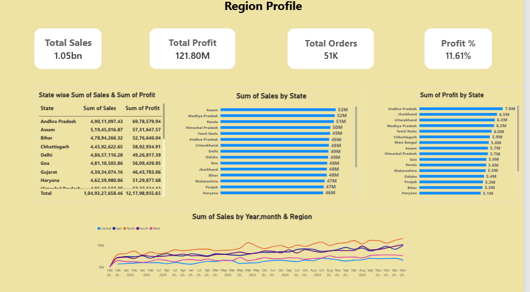
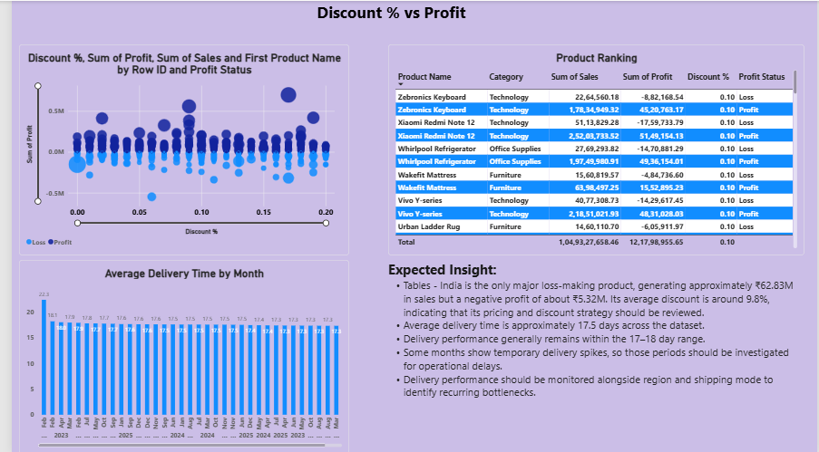
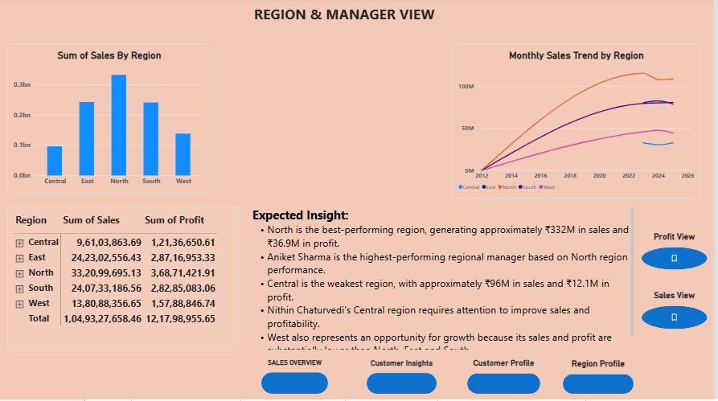
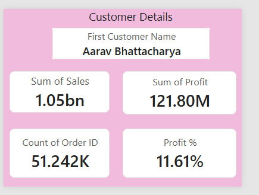
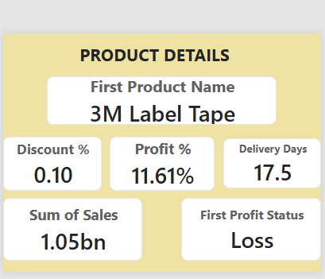

# Power BI Analytics Project

## 📊 Project Overview

This project is an interactive Power BI analytics dashboard designed to transform data into meaningful business insights through KPIs, charts, filters, and interactive visualizations.

The project demonstrates practical skills in data cleaning, data transformation, data modeling, DAX, dashboard development, and business intelligence using Microsoft Power BI.

## 🎯 Project Objectives

- Analyze data using Microsoft Power BI
- Clean and transform data using Power Query
- Create data models and relationships
- Develop meaningful DAX measures
- Create interactive KPI cards
- Build interactive dashboards
- Identify important trends and patterns
- Present analytical insights through data visualization

## 🛠️ Tools & Technologies

- Microsoft Power BI
- Power Query
- DAX
- Data Modeling
- Data Visualization

## 📂 Project Files

| File | Description |
|---|---|
| `Final power bi assignment.pbix` | Complete Power BI dashboard |
| `Power BI report file.pptx` | Project presentation |
| `Dashboard-1.png` | Dashboard screenshot |
| `Dashboard-2.png` | Dashboard screenshot |
| `Dashboard-3.png` | Dashboard screenshot |
| `Dashboard-4.png` | Dashboard screenshot |
| `Dashboard-5.png` | Dashboard screenshot |
| `Dashboard-6.png` | Dashboard screenshot |
| `Dashboard-7.png` | Dashboard screenshot |
| `Dashboard-8.png` | Dashboard screenshot |

## 🔄 Project Workflow

Raw Data  
↓  
Data Cleaning  
↓  
Power Query Transformation  
↓  
Data Modeling  
↓  
DAX Measures  
↓  
Dashboard Development  
↓  
Business Insights

## 📈 Dashboard Features

- KPI cards
- Interactive charts
- Slicers and filters
- Trend analysis
- Data-driven visualizations
- Interactive report pages
- Business insights

## 📸 Dashboard Preview

### Dashboard 1

### Dashboard 2

### Dashboard 3

### Dashboard 4

### Dashboard 5

### Dashboard 6

### Dashboard 7

### Dashboard 8

## 📌 Key Skills Demonstrated

- Data Cleaning
- Data Transformation
- Data Modeling
- DAX
- KPI Development
- Dashboard Design
- Data Visualization
- Business Intelligence
- Analytical Thinking

## 🚀 How to Open the Project

1. Download `Final power bi assignment.pbix`.
2. Install Microsoft Power BI Desktop.
3. Open the `.pbix` file in Power BI Desktop.
4. Interact with the dashboard using the available slicers and filters.

## 👤 Author

**Banti Das**

Aspiring Data Analyst | Python | SQL | Excel | Power BI
